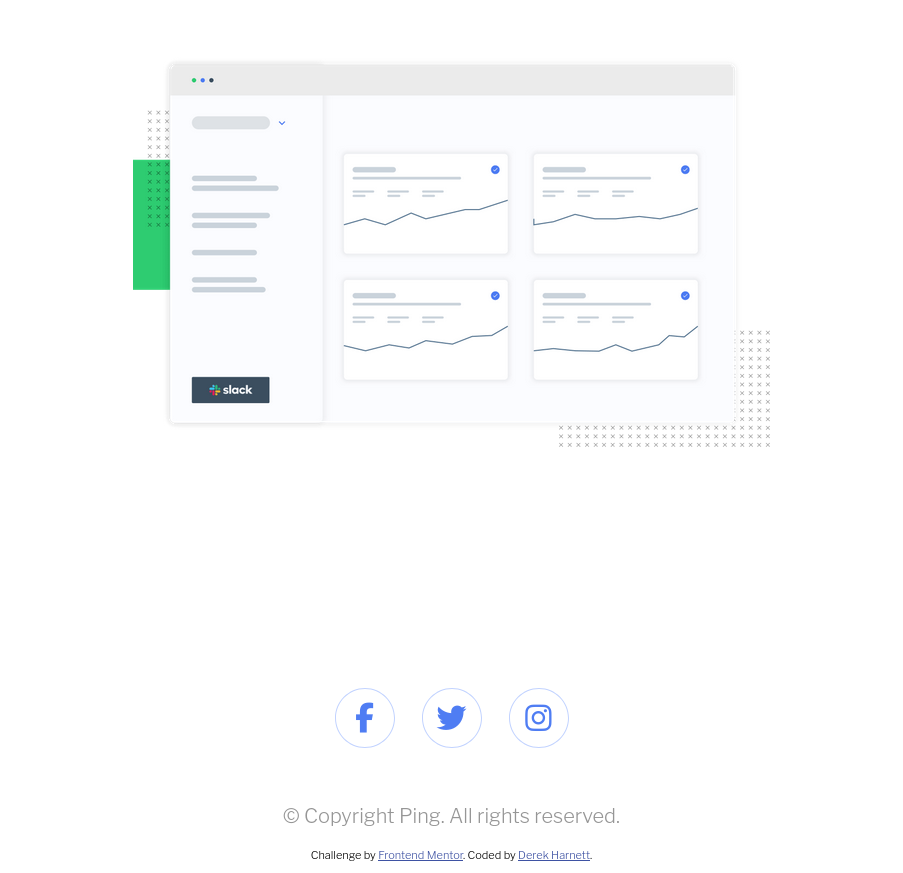

# Frontend Mentor - Ping coming soon page solution

This is a solution to the [Ping coming soon page challenge on Frontend Mentor](https://www.frontendmentor.io/challenges/ping-single-column-coming-soon-page-5cadd051fec04111f7b848da). Frontend Mentor challenges help you improve your coding skills by building realistic projects. 

## Table of contents

- [Overview](#overview)
  - [The challenge](#the-challenge)
  - [Screenshot](#screenshot)
  - [Links](#links)
- [My process](#my-process)
  - [Built with](#built-with)
  - [What I learned](#what-i-learned)
  - [Continued development](#continued-development)
  - [Useful resources](#useful-resources)
- [Author](#author)
- [Acknowledgments](#acknowledgments)

## Overview

### The challenge

Users should be able to:

- View the optimal layout for the site depending on their device's screen size
- See hover states for all interactive elements on the page
- Submit their email address using an `input` field
- Receive an error message when the `form` is submitted if:
	- The `input` field is empty. The message for this error should say *"Whoops! It looks like you forgot to add your email"*
	- The email address is not formatted correctly (i.e. a correct email address should have this structure: `name@host.tld`). The message for this error should say *"Please provide a valid email address"*

### Screenshot




### Links

- Solution URL: [https://github.com/harnettd/ping-coming-soon-page](https://github.com/harnettd/ping-coming-soon-page)
- Live Site URL: [https://harnettd.github.io/ping-coming-soon-page/](https://harnettd.github.io/ping-coming-soon-page/)

## My process

### Built with

- HTML5
- CSS3 including Flexbox
- sass
- JavaScript
- Mobile-first workflow

### What I learned

There wasn't really anything I needed on this project that I hadn't already used on other projects. I completed it mainly for additional practice working with simple forms and client-side data verification.

Having said that, this is the first project where I used the sass `@use` at-rule to help modularize my styles:

```scss
@use 'partials/vars' as *
@use 'partials/flex-signup-form' as *
@use 'partials/flex-socials-list' as *
```

### Continued development

I need to continue learning about forms, client-side validation, and UX/UI design as it pertains to error messages and indicators.

### Useful resources

- [@use](https://sass-lang.com/documentation/at-rules/use/) - This is where I learned how to use the sass `@use` at-rule.

## Author

- Github - [harnettd](https://github.com/harnettd)
- Frontend Mentor - [@harnettd](https://www.frontendmentor.io/profile/harnettd)

## Acknowledgments

As always, thanks to [Frontend Mentor](https://frontendmentor.io) for posting this challenge.
